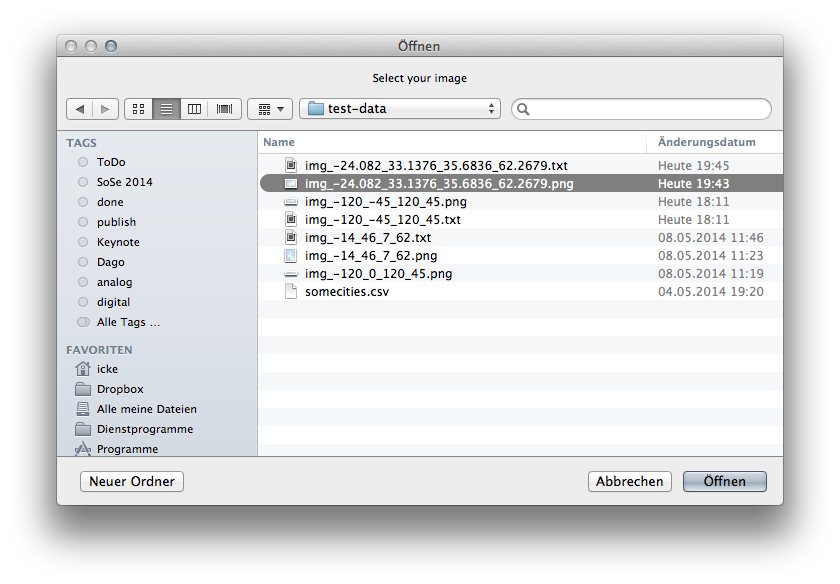
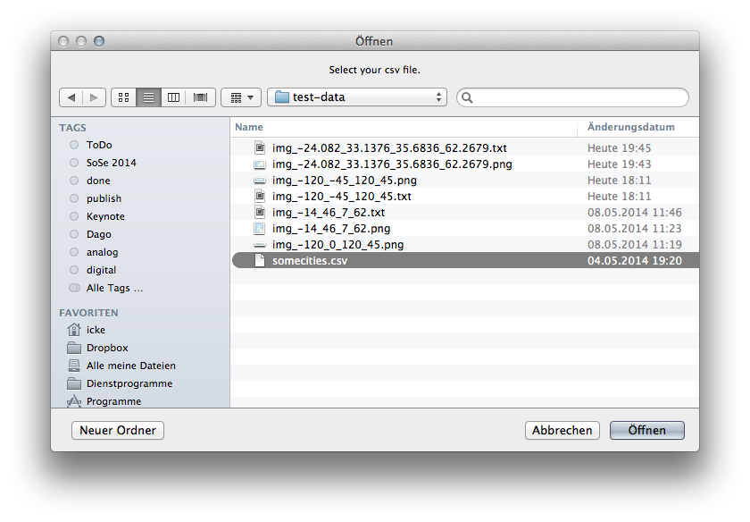
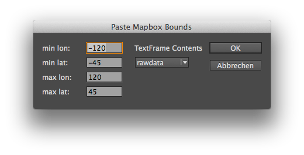
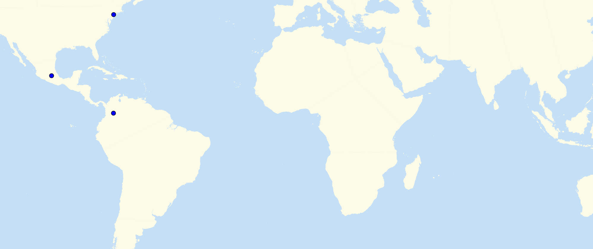

# extendscript.tilemill
export png images from tilemill and import them to InDesign.  

still w.i.p.  

## Getting Started
Download the [production version](https://github.com/fabiantheblind/extendscript.tilemill) from the folder dist.

- Export a PNG file from TileMill and save the used bounding box.  
- You can set some settings in the script.  

See these settings in the top of the script:  

    var DEBUG = true; // lots of output to the JS Console of ESTK
    var settings = {
      new_doc:true, // you can work in a existing doc. make sure you have the right bounding box
     new_layers: true, // use new layers for markers and text
      new_marker_layer_name: 'marker', // layer name
      new_text_layer_name: 'text', // layer name
      latitude_key:"", // just leave it alone the scripts looks for it by itself
      longitude_key:"",// just leave it alone the scripts looks for it by itself
      text_key:"",// just leave it alone the scripts looks for it by itself
      use_textframe:true, // set to true to create a text marker
      use_marker:true, // set to true to create a basic marker or use the selection
      // leave them alone if your csv uses one of these names 
      // the script analyses the data and tries to guess the lat lon fields by these naems
      possible_lat_keys : ["latitude","Latitude","LATITUDE","lat", "Lat","LAT"],
      possible_lon_keys : ["longitude","Longitude","LONGITUDE","lon", "Lon","LON"],
      /**
       * The following setting allows you to offset the marker
       * orientation possibilites are:
       * DEFAULT
       * CENTER
       * TOP
       * BOTTOM
       * LEFT
       * RIGHT
       * UPPER_LEFT
       * LOWER_LEFT
       * UPPER_RIGHT
       * LOWER_RIGHT
       */
      default_marker_orientation: "CENTER"
      };

- run the script from the InDesign Scripts Panel.

  

- select your image (optional: if you have `new_doc:true` set to true)

  

- then select your csv file

  

- the dialog comes up  
- enter the minimum maximum lat lon values from tilemill. 

  

- -120,-45,120,45 is ordered like this [min lon, min lat, max lon, max lat]
- if you use text markers. Select from the dropdown the field you want to enter.  
- see the magic happen.

Big thanks to @sebastian-meier for the awesome image geo location mapping.  

## Documentation
_(Coming soon)_

## Examples
_(Coming soon)_

## Release History
_(Nothing yet)_

## License  

Copyright (c)  2014 Fabian "fabiantheblind" Morón Zirfas  
Permission is hereby granted, free of charge, to any person obtaining a copy of this software and associated documentation files (the "Software"), to deal in the Software  without restriction, including without limitation the rights to use, copy, modify, merge, publish, distribute, sublicense, and/or sell copies of the Software, and to  permit persons to whom the Software is furnished to do so, subject to the following conditions:  
The above copyright notice and this permission notice shall be included in all copies or substantial portions of the Software.  
THE SOFTWARE IS PROVIDED "AS IS", WITHOUT WARRANTY OF ANY KIND, EXPRESS OR IMPLIED, INCLUDING BUT NOT LIMITED TO THE WARRANTIES OF MERCHANTABILITY, FITNESS FOR A  PARTICULAR PURPOSE AND NONINFRINGEMENT. IN NO EVENT SHALL THE AUTHORS OR COPYRIGHT HOLDERS BE LIABLE FOR ANY CLAIM, DAMAGES OR OTHER LIABILITY, WHETHER IN AN ACTION OF  CONTRACT, TORT OR OTHERWISE, ARISING FROM, OUT OF OR IN CONNECTION WITH THE SOFTWARE OR THE USE OR OTHER DEALINGS IN THE SOFTWARE.  

see also http://www.opensource.org/licenses/mit-license.php

